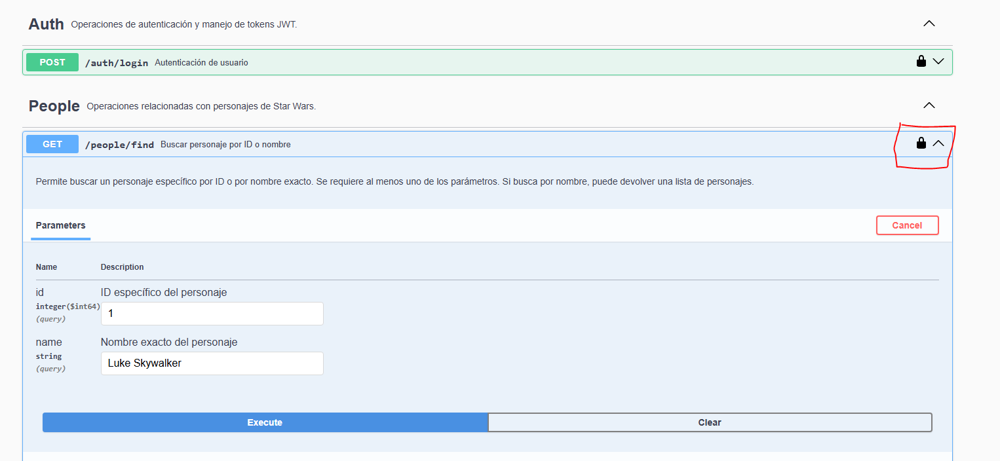

# Challenge Técnico

Este repositorio contiene código para el consumo de la api de StarWars (https://www.swapi.tech/documentation) y una parte de autenticación manejado con SpringSecurity.

**Consultar [SWAGGER](https://star-wars-challenge-tr6j.onrender.com/star-wars-service/v1/swagger-ui/index.html#/)**

## Arquitectura

El proyecto está compuesto por un microservicio:

- **Star-Wars-Service**: Este microservicio se encarga de consultar y traer desde la api de StarWars los personajes relacionados con las distintas películas de la saga. Permite filtrar tanto por id como por nombre. Además, requiere de un login desarrollado con SpringSecurity (gestión simple de un JWT que no periste en memoria).
- Idealmente, **la autenticación debería estar separada en un microservicio aparte** para una arquitectura más limpia, en donde se manejen roles de usuarios para verificar al momento de desencriptar el JWT los permisos por endpoint y exista una persistencia en memoria de usuario-password-roles.

## Diseño, consideraciones técnicas y posibles cambios a futuro

- **Uso de RestTemplate**: Idealmente se debería utilizar otra dependencia para las solcitudes HTTP (feign, retrofit) pero por una cuestión de tiempos decidí utilizar RestTemplate.
- **Header authorization y swagger**: Si bien mediante el candado que ofrece la interfaz de SwaggerUI se puede enviar el header Authorization, no pude lograr que en la definición de cada operación figure el header propio para enviar el token por ese medio y que sea un poco más intuitivo. De igual manera, funciona.
- **Operaciones restantes**: Faltarían consumir los recursos de: Films, Starships y Vehicles que por una cuestión de tiempos, no pude.
- **SpringSecurity**: Si bien estoy acostumbrado a trabajar con distintos estándares de seguridad como JWT, OAuth2.0 etc. Nunca trabajé directamente con este framework. Siempre tuve por delante una capa de abstracción que maneja la seguridad de las apis (apigw de ibm, apigw de AWS). 

## 📁 Estructura del proyecto

```plaintext
src/
├── main/
│   ├── java/
│   │   └── org/facundosaracho/starwarschallenge/
│   │       ├── business/            # Capa de negocio, servicios, etc.
│   │       ├── config/              # Swagger,Seguridad,etc.
│   │       ├── exception/           # Clases de excepción y enum con códigos de error.
│   │       ├── mapper/              # Mapper(mapstruct) global para mapeos automáticos de modelos,dtos.
│   │       ├── persentation/        # Capa de presentación, controladores REST/dtos
│   │       ├── proxy/               # Llamados HTTP -> clientes externos
│   │       └── App.java  # Clase principal
│   └── resources/
│       └── application.properties # Configuración de la aplicación
├── pom.xml
└── README.md
```

## 🚀 Endpoints disponibles

**Para hacer pruebas, puede hacerlas mediante el  [SWAGGER](ttps://star-wars-challenge-tr6j.onrender.com/star-wars-service/v1/swagger-ui/index.html#/) expuesto o utilizar la [COLECCIÓN](./postman-collection/Star-Wars-Collection.postman_collection.json) de postman.** 

### 🔑 POST /auth/login



*Genera un token JWT para autenticación de los endpoints protegidos. Utilizar el candado para ingresar el token*

**Request:** {ip:puerto}/star-wars-service/v1/auth/login

```json
{
  "username": "usuario",
  "password": "contraseña"
}
```

**Response**:

```json

{
  "token": "eyJhbGciOiJIUzI1NiIsInR5cCI6IkpXVCJ9..."
}
```

*Nota:* Usar este token en el header Authorization: Bearer <TOKEN> para acceder a endpoints protegidos.

### 📜 POST /people/find

*Permite obtener información de personajes de StarWars por id o por nombre.*

**Request:** http://{ip:puerto}/star-wars-service/v1/people/find?id=1&name=Skywalker

**Response**:
```json
{
    "people": [
        {
            "id": "5f63a36eee9fd7000499be42",
            "uid": "1",
            "description": "A person within the Star Wars universe",
            "version": 4,
            "name": "Luke Skywalker",
            "gender": "male",
            "height": "172",
            "mass": "77",
            "hairColor": "blond",
            "eyeColor": "blue",
            "skinColor": "fair",
            "birthYear": "19BBY",
            "homeworld": "https://www.swapi.tech/api/planets/1",
            "created": "2025-08-18T01:30:05.303Z",
            "edited": "2025-08-18T01:30:05.303Z",
            "url": "https://www.swapi.tech/api/people/1",
            "vehicles": [
                "https://www.swapi.tech/api/vehicles/14",
                "https://www.swapi.tech/api/vehicles/30"
            ],
            "starships": [
                "https://www.swapi.tech/api/starships/12",
                "https://www.swapi.tech/api/starships/22"
            ],
            "films": [
                "https://www.swapi.tech/api/films/1",
                "https://www.swapi.tech/api/films/2",
                "https://www.swapi.tech/api/films/3",
                "https://www.swapi.tech/api/films/6"
            ]
        }
    ],
    "message": "ok",
    "totalCount": 1
}
```

*Nota:* Se puede filtrar por id, por name o por ambos a la vez. Se debe enviar el header Authorization: Bearer 0YoubRdJaOvOz1..


### 📜 POST /people/find-all

*Permite obtener TODOS los personajes de StarWars mediante paginación. QueryParams: Size & Page*

**Request:**

{ip:puerto}/star-wars-service/v1/people/find-all?size=10&page=1

**Response:**
```json
{
    "person_dto": [
        {
            "uid": "1",
            "name": "Luke Skywalker",
            "url": "https://www.swapi.tech/api/people/1"
        },
        {
            "uid": "2",
            "name": "C-3PO",
            "url": "https://www.swapi.tech/api/people/2"
        },
        {
            "uid": "3",
            "name": "R2-D2",
            "url": "https://www.swapi.tech/api/people/3"
        },
        {
            "uid": "4",
            "name": "Darth Vader",
            "url": "https://www.swapi.tech/api/people/4"
        },
        {
            "uid": "5",
            "name": "Leia Organa",
            "url": "https://www.swapi.tech/api/people/5"
        },
        {
            "uid": "6",
            "name": "Owen Lars",
            "url": "https://www.swapi.tech/api/people/6"
        },
        {
            "uid": "7",
            "name": "Beru Whitesun lars",
            "url": "https://www.swapi.tech/api/people/7"
        },
        {
            "uid": "8",
            "name": "R5-D4",
            "url": "https://www.swapi.tech/api/people/8"
        },
        {
            "uid": "9",
            "name": "Biggs Darklighter",
            "url": "https://www.swapi.tech/api/people/9"
        },
        {
            "uid": "10",
            "name": "Obi-Wan Kenobi",
            "url": "https://www.swapi.tech/api/people/10"
        }
    ],
    "page_information": {
        "message": "ok",
        "totalRecords": 82,
        "totalPages": 9,
        "next": "https://www.swapi.tech/api/people?page=2&limit=10"
    }
}
```

*Nota:* Los parámetros Size & Page son obligatorios y no tienen un valor default.

## Tecnologías utilizadas

- **Java 17** (Para los microservicios)
- **Spring Boot** (Para la implementación de los microservicios)
- **SpringSecurity** (Para implementar un JWT básico con autenticación mediante username-password)
- **RestTemplate** (Para las solicitudes HTTP entre microservicios)
- **JUNit** (Test de integración y unitarios)
- **Mockito** (Test de integracion y unitarios)
- **Springdoc-OpenApi** (Documentación mediante swagger)
 -**Mapstruct** (Mapeos automátiocos)